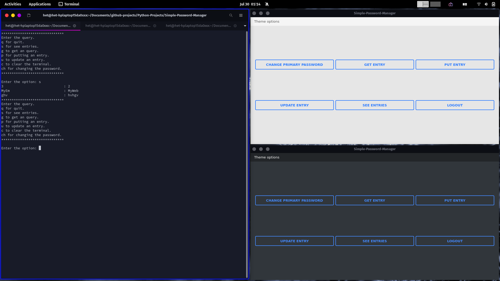

# Simple-Password-Manager

A python based simple password manager project with sqlite3 and encryption.

Encryption Algorithm used is AES-256 
Private Key made using SHA-256 
Authentication done using SHA-512 

## Features:
* Simple command line based work and GUI based operations.
* When getting an entry, it automatically puts the pass in the clipboard so you can paste it in the website.
* Supports multiple rounds of hashing. Currently setup for 1000 rounds of hash function. 
* Easy to change the number of rounds, just need to open Encryption.py and change the HASH_COUNT constant.
* Current Version: <b>1.6</b>
## How to run it:
* Command-Line:
  * Run src/mainCommandline.py and it will launch the required file for command line.
* GUI:
  * Run src/main.py and it will launch the setup if needed or launch the working if setup is done.

 

    python3 -m src.main # To run GUI.
    python3 -m src.mainCommandline # To run CommandLine.

## Images:
 

  

  

  

  

  

